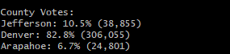
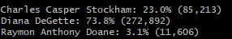
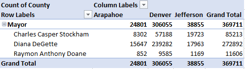

# Election_Analysis
CU-VIRT-DATA-PT-02-2021-U-B-TTH 
Module 03 : Data Analytics Class - Python

## Project Overview of Election Audit
A Colorado Board of Elections personnel assigned the following tasks to complete an audit of a recent local congressional election.

1. Calculate the total number of votes cast.
2. Calculate measures for the Counties.
	2a. List the Counties we are calculating the votes for.
	2b. Calculate the percentage of votes by County.
	2c. The voter turnout for each county.
	2d. Determine the Largest Country Turnout.
3. Calculate measures for Candidates:
	3a. Get a complete list of candidates who received votes
	3b. Total number of votes each candidate received
	3c. Calculate the percentage of votes each candidate won
4. Determine the winner of the election based on popular vote

## Resources
- Data Source:  [election_results.csv](Resources/election_results.csv) 
- Software: Python 3.8.5, Visual Studio Code 1.54.1, Git version 2.30.0.windows.2

## Analysis of the Election-Audit Results
Analysis File: [election_analysis.txt](analysis/election_analysis.txt)

- There were 369,711 votes cast in 3 Counties for this congressional election.

- Jefferson County cast 38,855 votes for 10.5% of the total votes.
- Denver County cast 306,055 votes for 82.8% of the total votes.
- Arapahoe County cast 24,801 votes for 6.7% of the total votes. 

- Denver Country had the largest Turnout of Votes in the election 

- Charles Casper Stockham received 85,213 votes and 23.0% of the total votes.
- Diana DeGette received 272,892 votes and 73.8% of the total votes.
- Raymon Anthony Doane received 11,606 votes 3.1% of the total votes.

- Diana DeGette won with 272,892 votes and 73.8% of the total votes.

## Summary
The [analysis](analysis/election_analysis.txt) of the election show that:
- There were 369,711 total votes cast in the election in the 3-county vote tally
- The Candidates whom received votes were:
	- Charles Casper Stockham
	- Diana DeGette
	- Raymon Anthony Doane
- The Candidate Results were: 
	- Charles Casper Stockham received 23% of the vote and 85,213 number of votes.
	- Diana DeGette received 73.8% of the vote and 272,892 number of votes.
	- Raymon Anthony Doane received 3.1% of the vote and 11,606 number of votes.
- The winner of the Election was: 
	- Diana DeGette, who received 73.8% of the vote and 272,892 number of votes.
	
## Challenge Overview
The data set provided three columns of information, a "Ballot ID", "County", and the "Candidate" voted for. With this date we need to compile a list of Candidates, and totals voter counts that each candidate received.
Some challenges with looking at the data or working with Excel (in 32 bit version) is that the number of lines 369,712 significantly exceeds 32-bit version capability of 65,536. And reviewing the data line by line would be near impossible. Also in addition, an assumption was made that the data set contains unique Ballot ID's, that one Ballot ID was cast for one Candidate.

## Challenge Election-Audit Summary
The challenge was accomplished using Python to read the Comma Separated File and display on the terminal and an analysis file of the accumulating result totals and noting the winner
Right now this code can only be used in a specific case of an election for a single office, vacancy or primary. What we want to be able to do is to modify this code to be able to handle a General Election with multiple positions up for election (in the state and local) races.
In order to process the Ballots by Position, we would need an additional column on the election_results.csv file stating the position that the candidates are running for: ['Ballot ID', 'County', 'Candidate', **'Position'**]. 

The first modification would be to add

\# 1: Create a position list and position votes dictionary.
position_options = []
position_votes = {}
...

as well as add another variable name and if condition under for row in reader:
 position_name = row[3]
...
​    if position_name not in position_options :
​      position_options .append(position_name )
​      position_votes[position_name] = 0
​    position_votes[candidate_name] += 1

Because the data in each line is linked together we should use a Python List of Dictionaries to store the data that looks like this `[{key1:value1, key2:value2, key3:value3, key4:value4}]`, i.e. `[{"County":"Jefferson", "Candidate":"Diana DeGette", "Position":"Mayor","votes":17963}]` so that we can not only see which counties had the most votes, but also whom they voted for. In the election, using a pivot table, we can see that Diana DeGette only won 2 out of the 3 Counties, and without Denver overwhelmingly voting for, Diane would have had 33,610 (15647 + 17963) votes for 55% of the votes to Charles 28,025 (8302 + 19723) 45% of the vote. 

Another modification is for a situation where an election is for a school board that places the **top 3 candidates** out of 10 in an election for a school board position. In a case like that we will need to have three sets of list and dictionary to accommodate the 

winning_candidate = ""
winning_count = 0
winning_percentage = 0

second_candidate = ""
second_count = 0
second_percentage = 0

third_candidate = ""
third_count = 0
third_percentage = 0